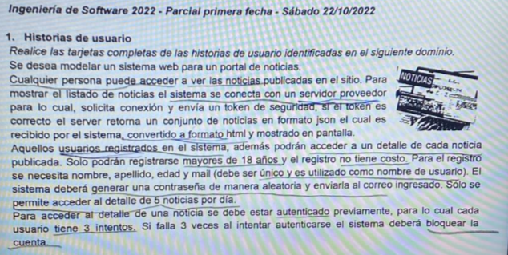

# Examen 2022

Hecho: No

- Persona
- Servidor externo
- Usuario registrado

---

- Registar usuario
- Ver noticia
- Iniciar sesion
- Cerrar sesion
- Acceder detalle

---

### Ver noticia

ID: Ver noticia

TITULO: Como persona quiero poder ver una noticia para informarme sobre lo que esta pasando

REGLAS DE NEGOCIO

---

Criterios de aceptación

Escenario 1: Ver noticia exitoso

Dado el que se puede establecer conexion con el servidor externo y el token de seguridad es correcto

Cundo el usuario el usuario selecciona ‘Ver noticias’

Entonces el sistema muestra las noticias en formato HTML

Escenario 2: Ver noticia fallido por fallo en la conexion con el servidor

Dado que no se puede establecer conexion con el servidor externo

Cuando el usuario selecciona ‘Ver noticias’

Entonces el sistema informa que hubo en fallo en la conexion con el servidor

Escenario 3: Ver noticia fallido por token invalido

Dado que se puede establecer conexion con el servidor y el token es invalido

Cuando el usuario selecciona ‘Ver noticias’

Entonces el sistema informa que el token de seguridad enviado es invalido

---

### Registrar usuario

ID: Registrar usuario

TITULO: Como persona quiero poder registrarme para poder acceder a los detalles de las noticias

REGLAS DE NEGOCIO: 

- Persona debe ser mayor de 18 años
- El registro no tiene costo
- Email debe ser unico y sera utilizado como nombre de usuario
- Se genera una contraseña aleatoriamente y se envia al email

---

Criterios de aceptación

Escenario 1: Registro exitoso

Dado una persona con email [diegogh@gmail.com](mailto:diegogh@gmail.com) no esta registrado previamente y edad 19 años valida 

Cuando la persona ingrese email [diegogh@gmail.com](mailto:diegogh@gmail.com) y edad 19 años

Entonces el sistema da de alta el nuevo usuario , genera una contraseña aleatoria y la envia al mail ingresado

Escenario 2: Registro fallido por email repetido

Dado una persona con email [waters@gmail.com](mailto:waters@gmail.com) ya esta registrado previamente, y edad 20 años valida

Cuando la persona ingrese email [waters@gmail.com](mailto:waters@gmail.com) y edad 20 años 

Entonces el sistema informa que el email ya se encuentra registrado 

Escenario 3: Registro fallido por persona menor de edad

Dado una persona con email [masu@gmail.com](mailto:masu@gmail.com) no esta registrado previamente y edad 17 años invalida

Cuando la persona ingrese email [masu@gmail.com](mailto:masu@gmail.com) y edad 17 años

Entonces el sistema informa que la persona debe ser mayor de edad

---

### Iniciar sesion

ID: Iniciar sesion

TITULO: Como usuario quiero iniciar sesion para acceder ver noticias y sus detalles

REGLAS DE NEGOCIO:

- El usuario tiene 3 intentos para iniciar sesion

---

Criterios de aceptación

Escenario 1: Inicio de sesion exitoso

Dado que el mail [diegogh@gmail.com](mailto:diegogh@gmail.com) que pertenece a un usuario del sistema y la contraseña 1234 que es valida

Cuando el usuario ingrese mail [diegogh@gmail.com](mailto:diegogh@gmail.com) y contraseña 1234 

Entonces se inicia la sesion del usuario

Escenario 2: Inicio de sesion fallido por email invalido

Dado que el mail [river@gmail.com](mailto:river@gmail.com) no pertenece a un usuario del sistema

Cuando el usuario ingrese mail [river@gmail.com](mailto:river@gmail.com) y contraseña 189

Entonces el sistema informa que el email ingresado no pertenece a un usuario registrado

Escenario 3: Inicio de sesion fallido por contraseña invalida sin bloqueo de usuario

Dado el mail [pipi@gmail.com](mailto:pipi@gmail.com) que pertenece a un usuario registrado y la contraseña 1234 es invalida y el usuario aun no ha llegado a los 3 intentos de inicio de sesion

Cuando el usuario ingrese [pipi@gmail.com](mailto:pipi@gmail.com) y contraseña 1234 

Entonces el sistema el sistema muestra el mensaje “error de autenticación, vuelva a intentarlo” y aumenta la cantidad de intentos fallidos

Escenario 4 : Inicio de sesion fallido por contraseña invalida con bloqueo de usuario

Dado el mail [papu@gmail.com](mailto:papu@gmail.com) que pertene a un usuario registrado y la contraseña 4444 es invalida y el usuario ha llegado a los 3 intentios de inicio de sesion

Cuando el usuario ingrese papu@gmail y contraseña 4444

Entonces el sistema muestra el Cuenta bloqueada por exceso de intentos y bloquea la cuenta

---

### Cerrar sesion

id: Cerrar sesión
Título: Como usuario registrado quiero cerrar sesión para salir del sistema
Reglas de negocio:

---

Escenario 1: Cierre de sesión exitoso
Dado el usuario [ingenieria@ingenieria.com](mailto:ingenieria@ingenieria.com) que ha iniciado sesión
Cuando se Presiona el botón “Cerrar sesión”
Entonces el sistema cierra la sesión del usuario y  redirige a la pantalla de inicio de sesión.

---

### Acceder al detalle

ID: Acceder detalle

TITULO: Como usuario registrado quiero acceder al detalle de una noticia para informarme mas sobre el tema

REGLAS DE NEGOCIO

- Solo se permite acceder al detalle de 5 noticias por dia

---

Criterios de aceptacion

Escenario 1: Acceso exitoso

Dado el usuario registrado  y autenticado con 1 acceso al detalle de noticias en el dia

Cuando el usuario registrado selecciona una notica y le da la opcion “Ver detalle”

Entonces el sistema muestra el detalle de la noticia

Escenario 2: Acceso fallido por exceso de detalles

Dado el usuario registro y autentica con 5 accesos al detalle de noticias en el dia

Cuando el usuario registrado selecciona una noticia y le da la opcion “Ver detalle”

Entonces el sistema informa que solo se permiten 5 accesos a detalles por dia

---