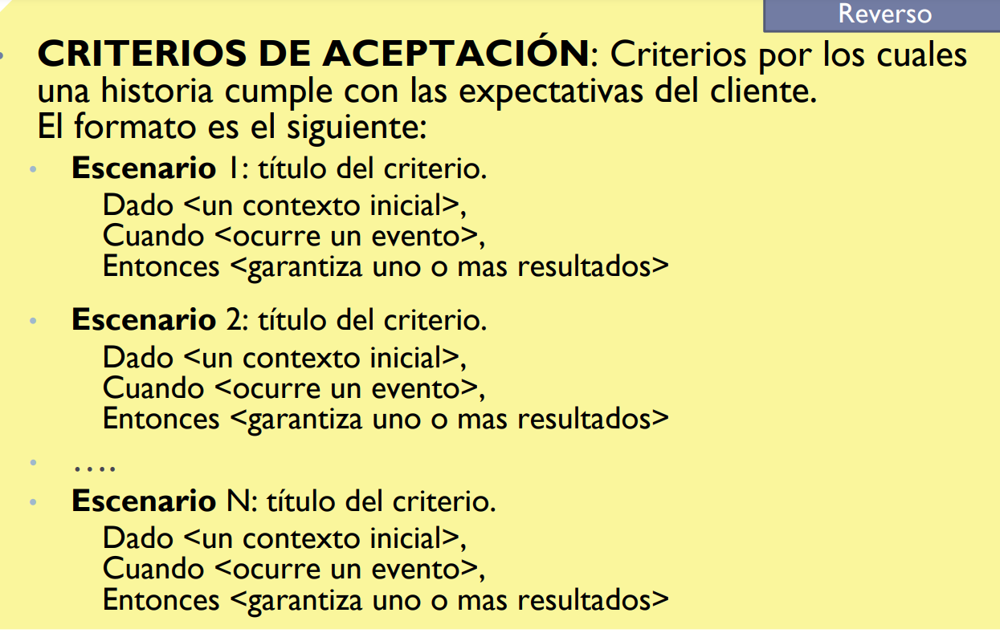

# Practica 2 - Historias de Usuario

Semana: August 26, 2024
Hecho: Yes
Tema: Historia de Uso
Tipo: Practica

# Historias de Usuario

- Una historia de usuario es una descripción corta y simple de un
requerimiento de un sistema, que se escribe en lenguaje común del
usuario y desde su perspectiva.
- Son utilizadas en las metodologías de desarrollo ágiles (Ejemplo: XP,
SCRUM) para la especificación de requisitos.
- La historia de usuario debe responder a las siguientes preguntas:
    - **¿ Quién se beneficia ?**
    - **¿ Qué se quiere ?**
    - **¿ Cuál es su beneficio ?**

<aside>
💡

**ID** : Identificador Univoco de la historia expresado como texto generalmente en forma de
**<verbo><sustantivo>**

TITULO:  Descripción de la historia de la forma: **Como** <rol> **quiero** <algo> **para** <beneficio>.

REGLAS DE NEGOCIO: Conjunto de reglas, normas, políticas, etc. que condicionan el modo de operación.

</aside>

## Ejemplo

Rol de usuarios:  

- Persona
- Matriculado

Historias de Usuario

- Matricular Persona
- Inscribir matriculado al curso
- Pagar con tarjeta

## -Tener en cuenta

- Roles de Usuario → Singular
- Historias de usuario → Verbo en infinitivo
- Cuando una historia tiene “muchos “ criterio de aceptación es una pauta para separarla en otras historias.
- Cuando varias historias tienen varios criterios de aceptación comunes deberian separarse en otras historias

---

### Matricular Persona

### Inscribir Matriculado

---

### Pagar con Tarjeta

---

## Ejemplo con Listado de cupos

- Listar cursos con cupo.
    - Si agregamos esta historia desaparece el escenario 2 de la HU “Inscribir a un curso” ya que solo se puede elegir un curso si previamente fue listado y por lo tanto tiene cupo.
    Además, si aclaramos que el botón de “Inscribirse” solo se muestra en los cursos en los que no se está inscripto previamente, también se puede eliminar el escenario 3 de la HU “Elegir un curso”. Esto mejora la experiencia del usuario, ya que de otra manera permitiríamos presionar “Inscribirse” sobre un curso al que el matriculado ya está inscripto y sabemos que fallará.

# Practica 1

## Problema 1 - Alquiler de mobiliario

Suponga que trabaja en una consultora la cual ha sido recientemente contactada por una empresa de alquiler de mobiliario para eventos para la realización de una app.
De las diferentes entrevistas se ha obtenido la siguiente información:
El gerente nos dijo que resulta fundamental tener una aplicación móvil que nos permita manejar la agenda de la empresa, sabiendo qué disponibilidad tenemos y permitiendo que nuestros clientes alquilen a través de la app. Para esta primera versión de la app, el gerente nos pidió que sea posible dar de alta los diferentes mobiliarios, así como la posibilidad de que los usuarios puedan realizar una reserva de alquiler desde sus dispositivos. Para el detalle de cómo se realiza la carga de los muebles, el gerente nos sugirió hablar con el encargado del departamento de mobiliario. El encargado de mobiliario nos comentó que de cada mueble se debe cargar código de inventario, tipo de mueble, fecha de creación, fecha de último
mantenimiento, estado (libre, de baja, alquilado) y el precio de alquiler. Además, no pueden existir códigos repetidos y por el contrato de la franquicia, el precio debe cargarse en dólares. Para que el encargado pueda dar de alta el mobiliario debe autenticarse en el sistema. El registro de los usuarios de carga no debe modelarse.
El encargado del departamento de alquileres no comentó acerca de las reservas de los alquileres. Por una política comercial de la marca una reserva tiene que incluir como mínimo 3 muebles. La reserva debe tener una fecha, lugar del evento, cantidad de días y mobiliario junto a su cantidad. Para realizar una reserva se debe abonar el 20% del total del alquiler. El pago de la reserva se realiza únicamente con tarjeta de crédito validando número de tarjeta y fondos a través de un servicio del banco. Luego de efectuado el pago, se emite un número de reserva único que será luego utilizado por el cliente para hacer efectivo el alquiler.

---

Rol de usuarios: 

- Cliente
- Encargardo de mobiliario

Historias de Usuario: 

- Cargar mueble
- Reservar muebles
- Pagar con Tarjeta

### Cargar Mueble

ID: Cargar Mueble

TITULO: Como encargado de mobiliario quiero ingresar un mueble a la app para que los clientes pueden realizar su reserva

REGLAS DE NEGOCIO: 

- No pueden existir codigos repetidos

---

Criterios de aceptacion: 

Escenario 1: Carga de mueble exitosa

**Dado** que el codigo 1234 no existe en el sistema 

**Cuando** el encargado de mobiliario ingresa el codigo de inventario 1234 , tipo de mueble mesa , fecha de creacion 1/1/2024 , fecha ultimo mantenimiento 20/08/2024 , estado libre, y el precio de alquiler 100 $ 

**Entonces** se registra correctamente el mueble en el sistema.

Escenario 2: Carga de mueble fallida por codigo repetido

Dado que el codigo 1235 ya se encuentra registrado en el sistema 
Cuando el encargado de mobiliario ingresa el codigo de inventario 1235, tipo de mueble mesa, fecha de creacion 1/1/2024, fecha de ultimo mantenimiento 20/08/2024, estado libre, y el precio de alquiler 100$
Entonces se registra correctamente el mueble en el sistema.

---

### Reservar Muebles

FRENTE 

ID : Reservar Muebles

TITULO: Como cliente quiero reservar un mueble para un evento

REGLAS DE NEGOCIO: 

- La reserva debe incluir como minimo 3 muebles.

---

Criterios de Aceptación : 

Escenario 1: Reserva exitosa

Dado que la reserva incluye 3 muebles  hay stock 

Cuando se ingresa fecha 9/9 , lugar Randomxd , cantidad de dias 1 , mobiliario mesas cantidad 3 

Entonces el sistema redirige al pago con tarjeta de la reserva , espera resultado y emite un número de reserva único  

Escenario 2 : Fallo reserva cantidad de muebles invalida

Dado que la reserva incluye 2 muebles , hay stock y la tarjeta es valida

Cuando se ingresa fecha 10/9 , lugar More , cantidad de dias 2 , mobiliario mesas cantidad 2

Entonces el sistema responde que la cantidad de muebles es invalida

Escenario 3: Fallo reserva por falta de stock

Dado que la reserva incluye 3 muebles , no hay stock y la tarjeta es valida

Cuando se ingresa fecha 11 /9 , lugar Pulse , cantidad de dias 3 , mobiliario sillas cantidad 5 

Entonces el sistema responde que no queda stock

---

### Pagar con Tarjeta

ID : Pagar con Tarjeta

Titulo : Como cliente/usuario quiero pagar con tarjeta para poder reservar mobiliario

REGLAS DE NEGOCIO:

- Se debe abonar el 20% del alquiler
- Solo se aceptan números correspondientes a tarjetas de crédito

---

Criterios de aceptación:

Escenario 1: Pago exitoso

Dado que se abona el 20% del alquiler ,la conexion con el banco es exitosa y el nro de tarjeta 1234 es valido y la tarjeta tiene saldo
Cuando el cliente ingrese el numero de tarjeta 1234,

Entonces el sistema registra el pago y retorna un resultado de exito

Escenario 2: Pago rechazado por no abonar 20% del alquiler

Dado que no se abona el 20% del alquiler , la conexion con el servidor del banco es exitosa y el numero de tarjeta 2333 es valido y la tarjeta tiene saldo
Cuando el cliente ingrese el numero de tarjeta 2333 

Entonces el sistema informa que la cantidad abonada es incorrecta y no registra el pago

Escenario 3: Pago rechazado por numero de tarjeta invalido

Dado que se abona el 20% del alquiler, la conexión con el servidor del banco es exitosa y el numero de tarjeta 4444 es invalido

Cuando el cliente ingrese el numero de tarjeta 4444

Entonces el sistema informa que la tarjeta es invalida y no registra el pago

Escenario 4 : Pago rechazado por conexion con el servidor fallida

Dado que no se puede establecer conexion con el servidor

Cuando el cliente quiere realizar el pago 

Entonces el sistema informa que no se pudo realizar conexion con el servidor del banco

Escenario 5 : Pago rechazado por saldo insfuciente

Dado que se abona el 20% del alquiler, la conexion con el servidor del banco es exitosa ,el numero de tarjeta 5555 es valida y la tarjeta no tiene salgo

Cuando el cliente ingrese el numero de tarjeta 5555

Entonces el sistema informa que el saldo en la tarjeta es insuficiente y no registra el pago.

---

## Problema 2 - Posgrado

Suponga que trabaja en el área de sistemas de la Facultad de Informática y se le solicitó la automatización del pago de carreras de posgrado. Inicialmente se coordinó una reunión con el director del posgrado y se obtuvo la siguiente información:
Ya que no se desea seguir cobrando el dinero en la secretaría, es necesario que los alumnos puedan pagar las carreras vía web. Como el director de posgrado no realiza tareas administrativas nos recomendó hablar con el secretario académico.
De la entrevista con el secretario académico se obtuvo la siguiente información:
Es necesario cargar las carreras a un sistema. En esta primera versión del sistema sólo se nos pidió esta funcionalidad, sin la modificación ni eliminación. De cada carrera se conoce: nombre de la carrera (no puede repetirse), duración en años (a partir de la consulta del estatuto de posgrado se obtuvo que como máximo son 5 años), costo y cantidad máxima de cuotas
para el pago. La carga de las carreras no la realiza el secretario académico sino un empleado administrativo. Al preguntarle por la dinámica del sistema, el secretario académico nos derivó con el jefe del área administrativa, con el cual hicimos otra entrevista y pudimos obtener la siguiente información:
El requerimiento fue que el alumno ingrese a la web de posgrado y pueda registrarse ingresando: nombre, apellido, nombre de usuario (único) y contraseña (más de 6 dígitos). Cualquier alumno previamente registrado, puede iniciar sesión.con su nombre de usuario y contraseña, habilitándose la inscripción a alguna de las carreras. Para ejemplificar esta
funcionalidad nos otorgaron acceso al sistema SIGEF, el cual realiza funcionalidades similares para las carreras de grado.
Para inscribirse, el alumno deberá seleccionar la carrera, ingresar la cantidad de cuotas a pagar, ingresar el número de tarjeta y, en caso de que la tarjeta sea válida y tenga fondos, se hará efectivo el cobro y la inscripción. La tarjeta de crédito se valida a través de un servicio del banco con el cual la universidad tiene convenio. Luego de efectuado el cobro, el sistema debe imprimir dos comprobantes, uno de inscripción y otro de pago. La única forma que tiene el alumno de pagar es con tarjeta de crédito.

---

Rol de usuarios:

- Alumnos
- Empleado administrativo
- Usuario

Historias de Usuario

- Pagar Carrera
- Cargar carrera
- Registrar usuario
- Iniciar sesion
- Validar Tarjeta

---

### Cargar carrera

ID : Cargar carrera

TITULO: Como empleado administrativo quiero poder cargar las carreras para que los alumnos puedan inscribirse

REGLAS DE NEGOCIO:

- Carrera no puede tener una duracion de mas de 5 años

---

Criterios de aceptación

Escenario 1: Carga de carrera exitosa

Dado que el nombre de carrera ‘Lic en Informatica’ no se encuentra en el sistema y la duracion de 5 años es valida

Cuando el empleado ingrese nombre de Carrera Lic en informatica y duracion 5 años
Entonces el sistema registra la carrera en el sistema y retorna un resultado exitoso

Escenario 2: Carga de carrera fallida por nombre repetido

Dado que el nombre de carrera ‘ Lic en sistemas ‘ ya esta cargado en el sistemy la duracion de 5 años es valida

Cuando el empleado ingrese el nombre de carrera Lic en Sistemas y duracion 5 años

Entonces el sistema retorna que la carrera ya se encuentra registrada en el sistema

Escenario 3: Carga de carrera fallida por duracion invalida

Dado que el nombre de carrera ‘ Ing en computación ‘ no se encuentra en el sistema y la duracion de 6 años es invalida

Cuando el empleado ingrese el nombre Ing en computación y duración 6 años

Entonces esl sistema retorna que la duracion de la carrera es invalida

---

### Registrar Usuario

ID : Registrar usuario

TITULO : Como alumno quiero poder registrarme como usuario para poder pagar una carrera

REGLAS DE NEGOCIO:

- Contraseña debe tener mas de 6 digitos

---

Criterios de aceptación:

Escenario 1: Registro de usuario exitoso

Dado que el nombre ‘diegogh’ es unico y la contraseña ‘diego1234’ tiene mas de 6 digitos

Cuando el alumno ingrese nombre de usuario ‘diegogh’ y la contraseña diego1234 

Entonces se registra el usuario en el sistema y retorna que el registro fue exitoso

Escenario 2: Registro de usuario fallido por nombre repetido

Dado que el nombre MessiGOAT no es unico y la contraseña ‘messi1234’ es valida

Cuando el alumno ingrese nombre de usuario MessiGOAT y la contraseña messi1234

Entonces el sistema retorna que el nombre de usuario ya esta elegido

Escenario 3: Registro de usuario fallido por contraseña invalida

Dado que el nombre pepito1234 es unico y la contraseña 12345 tiene menos de 6 digitos

Cuando el alumno ingrese nombre de usuario pepito1234 y la contraseña 12345 

Entonces el sistema retorna que la contraseña es invalida

---

### Iniciar Sesión

ID : Iniciar Sesión

TITULO: Como usuario quiero iniciar sesion para poder ver/pagar las carreras

REGLAS DE NEGOCIO:

---

Criterios de aceptación 

Escenario 1: Inicio de sesion exitoso

Dado que el nombre ‘diegogh’ se encuentra registrado en el sistema y la contraseña diego1234 es la correspondiente

Cuando se ingrese nombre diegogh y contraseña diego1234

Entonces se iniciara la sesion correctamente

Escenario 2: Inicio de sesion fallido por nombre no registrado

Dado que el nombre ‘timmy’ no se encuentra registrado en el sistema

Cuando se ingrese el nombre timmy y contraseña timmythekid

Entonces el sistema informara que el nombre de usuario no existe

Escenario 3: Inicio de sesion fallido por contraseña incorrecta

Dado que el nombre ‘jimmy’ se encuentra registrado en el sistema y la contraseña 12dknfd es incorrecta

Cuando se ingrese el nombre jimmy y contraseña 12dknfd

Entonces el sistema informara que la contraseña es incorrecta.

---

### Pagar Carrera

ID : Pagar carrera

TITULO: Como alumno quiero poder pagar una carrera para poder cursarla

REGLAS DE NEGOCIO:

- Se debe pagar con tarjeta de credito

---

Criterios de aceptación :

Escenario 1: Pago de carrera exitoso

Dado que la tarjeta de credito es validada correctamente

Cuando se ingrese las cuotas a pagar 12 y numero de tarjeta 12345 con saldo suficiente

Entonces se registra el pago y el sistema imprimie dos comprobantes, uno de inscripción y otro de pago

Escenario 2 : Pago de carrera fallido por tarjeta invalida

Dado que la tarjeta de credito es invalidada

Cuando se ingrese a pagar en 12 cuotas y numero de tarjeta 99999 

Entones se no se registra el pago y se informa que la tarjeta es invalida

---

### Validar Tarjeta

ID : Validar Tarjeta

TITULO: Como servicio de banco quiero validar una tarjeta de credito para que se pueda efectuar un pago

REGLAS DE NEGOCIO:

---

Criterios de aceptación:

Escenario 1 : Validacion de tarjeta exitosa

Dado que se establece la conexion con el servidor, el numero de tarjera 1234 es valido y la tarjeta tiene saldo

Cuando se ingrese numero de tarjeta 1234

Entonces el banco envia una señal de que la tarjeta es valida

Escenario 2: Validacion de tarjeta fallida por falla en la conexion con el servidor

Dado que no se puede stable la conexion con el servidor del banco

Cuando se intente validar la tarjeta

Entonces el banco envia que no se puede establecer conexion con el servidor

Escenario 3: Validacion de tarjeta fallida por numero de tarjeta invalido

Dado que se establece la conexion con el servidor del banco y el numero de tarjeta 2323 es invalido

Cuando se intente validar la tarjeta 2323

Entonces el banco envia que el numero de tarjeta es invalido

Escenario 4: Validacion de tarjeta fallida por saldo insuficiente

Dado que se establa la conexion con el servidor del banco y el numero de tarjeta 3433 es valido y no tiene saldo suficiente

Cuando se intente validar la tarjeta 3433

Entonces el banco envia que el saldo es insuficiente.

---

## Problema 3 - Contratos SIN TERMINAR

Suponga que trabaja en un grupo en el área de sistemas de una organización y está por comenzar un nuevo proyecto para desarrollar un sistema que depende del departamento contable.
El sistema deberá administrar los contratos realizado con terceros. En una de las reuniones con el jefe de departamento nos dijo que él no usará el sistema pero que recibirá listados del personal contratado ya que deberá firmarlos para elevarlos a las autoridades.
Para obtener más información generamos una reunión con el empleado de mesa de entradas. Nos contó que el problema que tienen actualmente es que realizan todas las minutas a mano por lo cual desean automatizar esta tarea. Las minutas son el paso previo a un contrato. Para confeccionar una minuta, el empleado de mesa de entradas debe ingresar nombre y número de CUIT de una persona a contratar, tipo de contrato, fecha de comienzo, duración y monto, a lo que el sistema le asociará un número de minuta automáticamente. Nos recomendó leer la reglamentación vigente acerca de contratos de la que obtuvimos que los montos de los mismos no pueden superar los $25.000 y que la duración debe ser como máximo de
6 meses. Una vez confeccionada la minuta por parte del empleado de mesa de entradas, la misma queda pendiente de aprobación. El que puede aprobar una minuta es el empleado de rendiciones. Realizamos una reunión con él y nos contó que su tarea consiste en evaluar las minutas para determinar su aprobación. También nos dijo que en otro trabajo que tiene usan un sistema llamado MiMiNuTa al que nos puede dar acceso para ver como hacen esa tarea. Después del análisis de este sistema, se concluyó que para aprobar una minuta necesitaría ingresar un número de minuta y que el sistema muestre los datos de la misma para poder aprobarla. Nos dijo que no puede aprobar la minuta si la persona a contratar tiene 3 contratos vigentes (minutas aprobadas) ni tampoco si el CUIT de la persona a contratar está inhabilitado por la AFIP. Actualmente se comunica telefónicamente con la AFIP para realizar esta verificación, pero sabe que ésta provee un servicio para aplicaciones que permite hacer la verificación en línea. Esto último nos obligó a generar una reunión con el administrador de servidores de la AFIP. Nos dijo que para poder conectarnos con un servidor de la AFIP, el sistema debe mandar un token (código que identificará de manera única a nuestra aplicación) y CUIT, si el token es correcto, el servidor responde si el CUIT está habilitado o no. → entonces del buscar
Por último el empleado de rendiciones será el responsable de imprimir los listados con las minutas aprobadas, es decir, un listado con el personal contratado para poder dárselo al jefe de departamento para que lo firme.

---

Rol de usuarios:

- Empleado de mesa de entradas
- Empleado de rendiciones

Historias de usuario: 

- Confeccionar Minuta
- Aprobar Minuta → directamene es une scenarioa donde apreto aceptar
- Evaluar minuta  → busca la minuta y el sistema le pega al servidor externo
- Imprimir minutas aprobadas

### Confeccionar Minuta

ID: Confeccionar Minuta

TITULO: Como empleado de mesa de entradas quiero confeccionar una minuta para que pueda ser aprobada

REGLAS DE NEGOCIO: 

- Monto no puede superar $25000
- Duración maxima de 6 meses

---

Criterios de aceptación 

**Escenario 1** : Confección de minuta exitosa

Dado que el monto de 25000 es valido y la duracion de 6 meses es valida

Cuando el empleado de mesa de entradas ingrese el nombre  ‘ Oppie’ , CUIT  ‘1234’ , tipo de contrato ‘A’  , fecha de comienzo 11/09/24 , duración de 6 meses y monto 25000

Entonces el sistema registra la minuta e informa el exito en la operación.

Escenario 2 : Confección de minuta fallida por monto invalido

Dado que el monto 27000 es invalido y la duración de 6 meses es valida

Cuando el empleado de mesa de entradas ingresa el nombre ‘Jose ‘ , CUIT ‘321’ , tipo de contrato B , fecha de comienzo 11/04/24 , duración de 6 meses y monto 27000

Entonces el sistema informa que el monto es superior al maximo.

**Escenario 3**: Confeccion de minuta fallida por duracion invalida

Dado que el monto 24000 es valido y la duración de 7 meses es invalida

Cuando el empleado de mesa de entradas ingresa el nombre ‘Martin‘ , CUIT ‘3421’ , tipo de contrato B , fecha de comienzo 11/04/24 , duración de 7 meses y monto 24000 

Entonces el sistema informa que la duración es superior al maximo.

### Aprobar Minutas

ID : Aprobar Minutas

TITULO: Como empleado de rendiciones quiero evaluar una minuta para poder determinar su aprobación

REGLAS DE NEGOCIO: 

- Personas con menos de 3 minutas aprobadas
- Persona con CUIT habilitado por AFIP

SIN TERMINAR  ¿ Conectar con AFIP Deberia ser otra historia de usuario ?

Codigo repetidp rela de negocio o condición?

## Problema 4 - Venta de bebidas SIN TERMINAR

Se desea modelar un sistema para el manejo de venta de bebidas alcohólicas en linea. Para poder empezar a comprar en el sitio, es necesario que las personas se registren ingresando nombre, apellido, mail (será utilizado como nombre de usuario por lo tanto debe ser único) y edad. Solo se permite que se registren al sitio personas mayores a 18 años, de lo contrario el
sistema debe mostrar en pantalla el texto de la ley que impide la venta de bebidas alcohólicas a menores. Si el registro es exitoso el sistema genera una contraseña que es enviada al mail ingresado en el registro. Para comprar el usuario debe iniciar sesión y una vez logueado el sistema muestra una lista de bebidas, una vez que el usuario selecciona todos los productos que desea comprar, si el usuario es premium se le hace un descuento del 20% y se informa en pantalla el total menos el 20%. Ademas si el usuario seleccionó productos por un monto superior a los $4500 se le hace un 10% de descuento y se informa en pantalla el total menos el 10%. Tenga en cuenta que si el usuario es premium y compra por un monto superior a $4500 se deben aplicar ambos descuentos.

### Registrar usuario

ID : Registrar Usuario

TITULO: Como cliente quiero poder registrarme como usuario para poder comprar bebidas

REGLAS DE NEGOCIO: 

- Usuarios mayores de 18 años

---

Criterios de aceptación: 

Escenario 1: Registro de usuario exitoso

Dado que la edad es mayor a 18 años y el mail [diegogarciaherd@gmail.com](mailto:diegogarciaherd@gmail.com) es unico 

Cuando el empleado ingresa bkbknblk

Escenario 2 : Registro de usuario fallido por edad menor a 18

Dado 

Cuando 

Entonces

Escenario 3: Registro de usuario fallido por email ya registrado

Dado 

Cuando

Entonces

---

### Iniciar sesión

ID : Iniciar sesión

TITULO: Como usuario quiero iniciar sesion para poder ver la lista de bebidas

REGLAS DE NEGOCIO:

---

Criterios de aceptación

Escenario 1: Inicio de sesion exitoso

Escenario 2: Inicio de sesion fallido por email no registrado

Escenario 3: Inicio de sesion fallido por contraseña incorrecta

---

### Cerrar sesión

### Comprar bebidas

REGLAS DE NEGOCIO:

- Si el usuario es premium se le aplica 20 %
- Si es superior a 4500

Escenarios

- No hay descuento
- Hay descuento de 4500
- Descuento premium

---

SIN TERMINAR - ¿ Como modelo comprar hacer los descuentos segun si es premium o no ?

---

## Problema 5 - Casa de fotografía

Se desea desarrollar un sistema para la impresión de fotos para una casa fotográfica. Los clientes pueden subir sus fotos, pagar por internet y luego ser retiradas personalmente por el local.
Para subir las fotos la persona debe registrarse en el sitio, ingresando sus datos personales, nombre, apellido, email, domicilio, nombre de usuario y contraseña.
Una vez autenticado, el usuario puede subir un máximo de 50 fotos para ser impresas. Las fotos se ingresan de a una. Una vez subidas, el usuario debe abonar el monto total (el valor de cada foto es de $15). El pago se realiza con tarjeta de crédito, ingresando los datos de la misma (número de tarjeta, código de seguridad y nombre del titular), la cual debe ser validada a través del sistema del banco. Una vez que se realiza el pago se le otorga al cliente un código
único que le servirá posteriormente para retirar las fotos.
Un cliente debe acercarse a la sucursal para retirar las fotos enviadas previamente. Para esto debe presentar el código único a un empleado. Este registra el código, la fecha de retiro y entrega las fotos al cliente.

---

Rol de usuarios :

- Clientes
- Empleado

Historias de usuario

- Registrar usuario
- Subir fotos
- Pagar con tarjeta
- Retirar fotos

---

### Registrar Usuario

ID : Registrar usuario

TITULO: Como cliente quiero registrarme como usuario para poder ingresar al sitio 

REGLAS DE NEGOCIO:

---

Criterios de aceptación:

Escenario 1: Registro de usuario exitoso

Escenario 2: Registro de usuario fallido por usuario ya ingresado

### Iniciar Sesión

### Cerrar sesion

### Subir fotos

ID : Subir fotos

TITULO: Como usuario quiero poder subir mis fotos para poder imprimirlas

REGLAS DE NEGOCIO:

- Maximo 50 fotos de a una
- Fotos de a una

---

Criterios de aceptacion

Escenario 1 : Foto subida con exito

Escenario 2: Fallo subir foto porque el usuario supero el maximo de fotos subidas

Escenario 3: Fallo subir foto porque el usuario sube mas de una foto al mismo tiempo

---

### Pagar con tarjeta

### Retirar fotos

## Problema 6 - Biblioteca

La biblioteca de una escuela primaria realiza su trabajo de forma manual y requiere un sistema informático que automatice su funcionamiento.
La bibliotecaria recibe libros por donaciones de los padres de los chicos que asisten a la escuela. De un mismo libro se pueden tener varios ejemplares.
Para que un alumno pueda asociarse debe presentar el DNI y certificado de alumno regular. Una vez asociado, se le otorga un carnet con su correspondiente número de socio.
Los préstamos se realizan exclusivamente a socios habilitados, que no posean más de tres préstamos vigentes y no tengan préstamos vencidos. La bibliotecaria presta libros que se encuentren en buen estado. Cuando un libro se encuentra deteriorado ya no se presta.
Cuando el socio retorna un libro se verifica si el préstamo se encuentra vencido. En este caso, la bibliotecaria suspende al socio, que por 15 días no podrá solicitar nuevos préstamos.

Rol de usuarios: 

- Alumno
- Socio habilitado

Historias de Usuario:

- Asociar alumno
- Realizar prestamo
- Retornar Libro

---

### Asociar alumno

ID : Asociar alumno

TITULO: Como alumno quiero asociarme a la biblioteca para poder pedir prestamos de libros.

REGLAS DE NEGOCIO:

- Certificador de alumno regular

---

Criterios de aceptación:

Escenario 1 : Alumno asociado exitosamente

Dado que el dni 43243543 no se encuentra registrado en el sistema y el certificado de alumno regular es vigente

Cundo el alumno presenta su dni 43254624 y su certificado de alumno regular

Entonces se le otorga al alumno el carnet correspondiente.

Escenario 2 : Fallo de asociacion de alumno por dni ya registrado

Dado que el dni 23322334 ya se encuentra registrado en el sistema

Cuando 

Escenario 3 : Fallo de asociacion por no presentar certificado de alumno regular

---

### Pedir prestamo

ID: Pedir prestamo

TITULO: Como alumno quiero pedir un prestamo para poder accerder un libro

REGLAS DE NEGOCIO: 

- Socios habilitados
- No mas de 3 prestamos vigentes
- Sin prestamos vencidos
- Libros en buen estado

---

Criterios de aceptacion:

Escenario 1 : Prestamo realizado con exito

Dado que el alumno con dni 32323323 esta habilitado , tiene 3 prestamos vigentes, no tiene prestamos vencidos y el libro que ha pedido esta en buen estado

Cuando el socio solicita el prestamo del libro ‘Crimen y castigo’

Entonces el sistema registra el prestamo del libro Crimen y lo añade a los prestamos vigentes del socio.

Escenario 2 : Fallo en el prestamo por alumno no asociado

Dado que el alumno con dni 56666666 no se encuentra asociado al sistema

Cuando el alumno solicite el prestamo de Habitos atomicos

Escenario 3: 

## Problema 7 - Mutual

Una mutual necesita automatizar el manejo de las prestaciones que ofrece a sus afiliados.
Una persona puede afiliarse sólo si posee una tarjeta de crédito para que se pueda hacer el pago de la cuota mensual automáticamente. Una vez que la persona se ha afiliado, puede pasar a tener a cargo a su pareja e hijos (hasta 18 años, luego es dado de baja). A cada uno se le otorga un número de afiliado.
Las prestaciones que brinda, siempre y cuando esté asentado el pago del mes anterior al que es solicitado, son:
- Ortodoncia: Se reconoce sólo una y a los afiliados menores de 15 años que estén afiliados desde al menos nueve meses. Debe presentarse historia clínica elaborado por el profesional.
- Plantillas: A cualquier afiliado, hasta dos por año calendario. Debe presentarse la indicación del profesional y factura del comercio que la confeccionó.
- Anteojos: A cualquier afiliado con fecha de afiliación superior a tres meses, un par cada 18 meses.
- Internación: A cualquier afiliado, sin límite.
- Consultas médicas: A cualquier afiliado, hasta 2 por mes.

---

### Afiliar persona

**FRENTE**

ID: Afiliar persona

TITULO: Como persona quiero afiliarme para acceder a las prestaciones brindadas

REGLAS DE NEGOCIO:

- La persona debe poseer una tarjeta credito

---

**DORSO**

Criterios de aceptación

Escenario 1 : Afiliacion exitosa

Dado que la persona con dni 33333 y con tarjeta de credito valida con el numero 22222

Cuando la persona ingrese dni 33333 y tarjeta de credito valida con el numero 22222

Entonces se registra la afiliacion de la persona

Escenario 2 : Afiliación fallida por **por tarjeta invalida.**

**Dado** una persona con DNI 1234 y la tarjeta de debito con el numero 5322.

**Cuando** la persona ingresa el DNI 1234 y el numero de tarjeta 5322 y presiona "Afliliarse".

**Entonces** el sistema informa que la tarjeta es invalida

---

### Asociar familiar

ID : Asociar familiar

TITULO: Como afiliado quiero poder asociar un familiar para que puedan disfrutar los beneficios

REGLAS DE NEGOCIO: 

- Hijos deben tener menos de 18 años

---

**Escenario 1: Asociacion de pareja exitosa.**

**Dado** un afiliado con DNI 123 y su pareja con DNI 1234.

**Cuando** el afiliado ingresa el su DNI (123) y el de su pareja (1234) y presiona "Asociar Familiar".

**Entonces** el sistema crea registra la operacion y informa el numero de afiliado de la pareja del afiliado

**Escenario 2: Asociacion de hijo exitosa.**

Dado un afiliado con DNI 124 y su hijo de 16 años con DNI 1235.

**Cuando** el afiliado ingresa el su DNI (124) y el de su hijo (1235) y presiona "Asociar Familiar".

**Entonces** el sistema crea registra la operacion y informa el numero de afiliado del hijo del afiliado.

**Escenario 3: Asociacion de hijo fallida por edad mayor a la maxima.**

**Dado** un afiliado con DNI 125 y su hijo de 21 años con DNI 1236.

**Cuando** el afiliado ingresa el su DNI (125) y el de su hijo (1236) y presiona "Asociar Familiar".

**Entonces** el sistema informa que la operacion no se llevo a cabo por que el hijo del afiliado tiene mas de 18 años.

### Prestar Ortodoncia

**ID**: Prestar ortodoncia

**TITULO** : Como afiliado quiero poder obtener un prestamo de ortodencia para arreglar mis dientes

**REGLAS DE NEGOCIO**

- Pago asentado desde el mes anterior
- Se puede realizar una sola vez por afiliado
- Afiliado debe ser menor de 15 años que esta afiliado hace mas de 9 meses
- Debe presentarse historia clínica elaborado por el profesional

---

**Criterios de aceptación**

Escenario 1 : Prestamo realizado exitosamente

**Dado** que el afiliado con el dni 33344445 tiene el pago asentado desde el mes anterior ,  no se realizo un prestamo de ortodoncia previamente, tiene 14 años , esta afiliado hace 10 meses y presento una historia clinica elaborada por un profesional

**Cuando** el afiliado ingrese el dni 33344445 y seleccione ‘ Solicitar prestamo ortodoncia”

**Entonces** el sistema registra la operacion y emite un comprobante que sera usado por el afiliado para realizar la ortodoncia.

Escenario 2 : Prestamo fallido por prestamo ya solicitado 

Dado que el afiliado con el dni 666666 tiene el pago asentado desde el mes anterior ,  ya solicite un prestamo de ortodoncia , tiene 13 años , esta afiliado hace 10 meses y presento una historia clinica elaborada por un profesional

**Cuando** el afiliado ingrese el dni 666666 y seleccione ‘ Solicitar prestamo ortodoncia”

**Entonces** el sistema informa que no puede pedir un prestamo de ortodoncia porque ya realizo uno previamente

Escenario 3: Prestamo fallido por edad mayor a 15 años

**Dado** que el afiliado con el dni 7777777 tiene el pago asentado desde el mes anterior ,  nunca solicito un prestamo de ortodoncia , tiene 16 años , esta afiliado hace 10 meses y presento una historia clinica elaborada por un profesional

**Cuando** el afiliado ingrese el dni 7777777 y seleccione ‘ Solicitar prestamo ortodoncia”

Entonces el sistema informa que no puede pedir un prestamo porque es mayor de 15 años

Escenario 4: Prestamo fallido por no cumplir con los meses de antiguedad requeridos

Dado que el afiliado con el dni 4232221 tiene el pago asentado desde el mes anterior ,  nunca solicito un prestamo de ortodoncia , tiene 10 años , esta afiliado hace 7 meses y presento una historia clinica elaborada por un profesional

Cuando el afiliado ingrese el dni 4232221 y seleccione ‘ Solicitar prestamo ortodoncia”

Entonces el sistema informa que no puede pedir un prestamo porque no cumple con los meses de antiguedad requeridos

Escenario 5: Prestamo fallido por **falta de historia clinica.**

Dado que el afiliado con el dni 11114444 tiene el pago asentado desde el mes anterior ,  nunca solicito un prestamo de ortodoncia , tiene 11 años , esta afiliado hace 12 meses y no presento una historia clinica elaborada por un profesional

Cuando el afiliado ingrese el dni 11114444 y seleccione ‘ Solicitar prestamo ortodoncia”

Entonces el sistema informa que el afiliado debe presentar la historia clinica

Escenario 6: Prestamo fallido por no tener asentado pago del mes anterior

Dado que el afiliado con dni 11113232 no tiene asentado el pago del mes anterior

Cuando el afiliado ingrese el dni 111115454 y seleccione ‘ Soliciar prestamo ortodoncia”

Entonces el sistema informa que el afiliado no tiene asentado el pago del mes anterior

### Prestar plantilla

ID : Prestar plantilla

TITULO: Como afiliado quiero poder pedir un prestamo de plantilla para poder utilizarla

REGLAS DE NEGOCIO:

- Solo se reconocen 2 por año
- Asentado el pago desde el mes anterior
- Debe presentarse la indicación del profesional
- Debe presentarse factura del comercio que la confeccionó.

---

Criterios de aceptación

Escenario 1: Prestamo de plantilla exitoso

Dado que el afiliado con DNI 123, tiene asentado el pago del mes anterior, posee indicacion del profesional, factura del comercio que confecciono las plantillas, y no se hizo plantillas previamente en el año

**Cuando** el socio ingresa el DNI 123, ingresa la indicacion del profesional, la factura, y selecciona la opcion de "Realizar Plantilla".
Entonces el sistema registra la operacion y emite un comprobante que sera usado por el afiliado para realizar la plantilla.

Escenario 2 : Prestamo fallido por exceso de plantillas realizadas

Dado que el afiliado con dni 333333, tiene asentado el pago del mes anterior , posee indicacion del profesional, factura del comercio que confecciono las plantillas, y realizo 2 prestamos de plantillas en el año

Cuando el socio ingresa el DNI 333333, ingresa la indicacion del profesional, la factura, y selecciona la opcion de "Realizar Plantilla".
Entonces el sistema informa que ya exedio la cantidad de plantillas permitidas por año.

Escenario 3: Prestamo fallido por falta de indicación profesional

Dado que el afiliado con DNI 4321, tiene el pago asentado del mes anterior ,que no posee indicacion del profesional, tiene factura del comercio que confecciono las plantillas, y se hizo 1 plantilla previamente en el año

Cuando el socio ingresa el DNI 4321, ingresa la factura, y selecciona la opcion de "Realizar Plantilla”

Entonces el sistema informa que ya exedio la cantidad de plantillas permitidas por año.

Escenario 4 : Prestamo fallido por que no se presenta la factura del comercio que la confecciono

Dado que el afiliado con DNI 55555, tiene el pago asentado del mes anterior que presenta indicacion del profesional,  y se hizo 1 plantilla previamente en el año

Cuando el socio ingresa el DNI 55555, presenta indicacion dle profesional y selecciona la opcion de "Realizar Plantilla”

Entonces el sistema informa que se debe presentar la factura del comercio que lo realizo

Escenario 5 : Prestamo fallido por no tener el pago asentado del mes anterior

Dado que el afiliado con dni 11113232 no tiene asentado el pago del mes anterior

Cuando el afiliado ingrese el dni 111115454 y seleccione ‘ Soliciar prestamo ortodoncia”

Entonces el sistema informa que el afiliado no tiene asentado el pago del mes anterior

---

### Prestar anteojos

ID: Prestar anteojos

TITULO: Como afiliado quiero realizar un prestamo de anteojos para ver mejor

REGLAS DE NEGOCIO:

- Afiliado fecha de afiliacion superior a 3 meses
- Solo se puede accerder a un par cada 18 meses

---

Criterios de aceptación:

Escenario 1: Prestamo de anteojos realizado con exito

**Dado** un afiliado con DNI 123, que tieneque se afilio hace 10 meses, y no solicito un par de anteojos previamente.

**Cuando** el socio ingresa el DNI 123, y selecciona la opcion de "Realizar Anteojos.".

**Entonces** el sistema registra la operacion y emite un comprobante que sera usado por el afiliado para realizar el par de anteojos

### Prestar internación

### Pedir consulta medica

## Problema 8 - Teatro

Se desea modelar un sistema de gestión de ventas de entradas para un teatro. Las personas compran sus entradas a través de una página web, o personalmente.
El sistema permite, sólo de modo personal en el teatro, la reserva de entradas de forma gratuita. El empleado debe ingresar los datos de la obra (fecha, hora, y nombre) junto el nombre y DNI del espectador. En este caso, sólo se podrá reservar hasta 2 entradas. Las entradas reservadas no compradas caducarán tres horas antes del evento. Para seleccionar el nombre de la obra, el sistema muestra una grilla de funciones disponibles para que el usuario seleccione una.
Para comprar una entrada vía web, el sistema muestra la grilla de funciones disponibles. El usuario selecciona una opción, ingresa su DNI, la cantidad de lugares solicitados y selecciona la opción “pagar”. El pago se realiza con tarjeta de crédito. Para esto debe ser autorizada a través del sistema del banco. Este pide el número de tarjeta, vencimiento, y código de seguridad. Verifica todos los campos y autoriza la compra. Autorizada la tarjeta, se emite un código de compra con el que el cliente podrá retirar sus entradas en la boletería del cine.
Para comprar una entrada personalmente, el vendedor de la boletería solicita los datos de la función al cliente, procediendo de un modo similar a la compra web, con la diferencia que en este caso no se muestra el código de compra sino que se imprimen directamente la/s entrada/s. El pago es unicamente con tarjeta de crédito, igual que en el caso anterior.
Para retirar las entradas reservadas previamente, el empleado solicita nombre y DNI del espectador, el sistema valida que la persona posea entradas reservadas, y que no estén caducas. El resto del procedimiento se realiza igual que la compra de entradas descriptas anteriormente.
Cuando una persona llega con el código de compra, el vendedor debe ingresar el código para que el sistema, luego de verificarlo, imprima las entradas correspondientes.
Además se desea administrar la programación de las salas. El administrador ingresa la distribución semanal de las obras en las salas de manera que se encuentre disponible para la realización de la venta de entradas.

### Reservar entrada

ID: Reservar entrada

TITULO: Como persona quiero reservar una entrada para poder retirarla luego

REGLAS DE NEGOCIO:

- Solo se solicitar 2 entradas como maximo

---

Criterios de aceptación

Escenario 1: Reserva exitosa

Dado un cliente con DNI 2233223 con nombre Pepo que desea reservar 2 entradas

Cuando el empleado selecciona los datos: obra “Grease” hora de obra 18:00 hs fecha 19/09 cantidad de entradas 2 , nombre de espectador Pepo , dni 2233223

Entonces el sistema registra la reserva de las entradas para el clienta y muestra un mensaje de exito

Escenario 2: Reserva fallida por superar numero maximo de entradas

Dado un cliente con DNI 2222222 con nombre Maximo que desea reservar 3 entradas

Cuando el empleado selecciona los datos : obra “Shakespeare in love “ hora de obra 22:00 hs fecha 19/10 cantidad de entradas 3 , nombre de espectador Maximo , dni 2222222

Entonces el sistema informa que no se pueden reservar mas de 2 entradas

### Comprar una entrada online

ID : Comprar una entrada online

TITULO: Como usuario quiero comprar una entrada online para ver una obra de teatro

REGLAS DE NEGOCIO: 

---

Criterios de aceptación

Escenario 1: Compra exitosa

Dado el usuario con dni 3333 y las condiciones estan dadas para un pago exitoso

Cuando el usuario seleciona la obra “Grease” , ingresa dni 3423 , cantidadad de lugares 1
y selecciona la opción “Pagar”

Entonces el redirige al usuario al pago con tarjeta de credito, espera respuesta , registra la compra y emite un código de compra 

Escenario 2 : Compra fallida por error en el pago con tarjeta

**Dado** el usuario con DNI 524, y que las condiciones no son las adecuadas para un pago exitoso.

**Cuando** el usuario selecciona una obra, ingresa el DNI 524, ingresa que desea 6 entradas y presiona "Pagar".

**Entonces** el sistema redirige al usuario al pago co tarjeta de credito, espera respuesta, y informa que ocurrio un error en el pago, por lo que no se pudo llevar a cabo la compra.

---

### Comprar entrada personalmente

ID: Comprar entrada personalmente

TITULO: Como cliente quiero comprar una entrada para ver una obra

REGLAS DE NEGOCIO:

---

Criterios de aceptación

Escenario 1 : Compra exitosa

Dado que el cliente con dni 333222 y estan dadas las condiciones para un pago exitoso

Cuando el empleado seleccione obra “Napoleon” ingresa dni 333222 y cantidad de asientos 5 

Entonces el sistema redirige al pago con tarjeta, espera respuesta ,e imprime las entradas 

Escenario 2: Compra fallida por fallo en el pago

Dado que el cliente con dni 5555 y estan dadas las condiciones para un pago exitoso

Cuando el empleado seleccione obra “abc” ingresa dni 5555 y cantidad de asientos 1

Entonces el sistema redirige al pago con tarjeta, espera respuesta ,e informa error en el pago con tarjeta

---

### Pagar con tarjeta

ID: Pagar con tarjeta

TITULO: Como usuario quiero pagar con tarjeta para comprar entradas

REGLAS DE NEGOCIO: 

- Solo se aceptan números correspondientes a
tarjetas de crédito

---

Criterios de aceptación

Escenario 1: Pago exitoso

Dado que la conexión con el servidor del banco es exitosa, el número 1234 corresponde a una tarjeta de crédito y la tarjeta tiene saldo

Cuando la persona ingresa el número de tarjeta 1234 y presiona “Pagar” 

Entonces el sistema registra el pago y retorna un resultado de éxito.

Escenario 2: Pago fallido por número de tarjeta de crédito inexistente

Dado que la conexión con el servidor del banco es exitosa y el número 3456 no
corresponde a un número de tarjeta de crédito,

Cuando el matriculado o la persona ingresa el número de tarjeta 3456 y presiona “Pagar”

Entonces el sistema retorna un error por número de tarjeta inexistente

Escenario 3: Pago fallido por saldo insuficiente de tarjeta de crédito

Dado que la conexión con el servidor del banco es exitosa y el número de tarjeta 2134
corresponde a una tarjeta de crédito y no tiene saldo para el pago que se solicita hacer

Cuando el matriculado o la persona ingresa el número de tarjeta 2134 y presiona “Pagar”

Entonces el sistema retorna un error por saldo insuficiente.

Escenario 4: Pago fallido por fallo en la conexión con el servidor externo del banco

Dado que no se pudo realizar la conexión con el servidor del banco

Cuando el matriculado o la persona ingresa un número de tarjeta y presiona “Pagar”

Entonces el sistema retorna un error por conexión fallida.

---

### Retirar entradas reservadas

ID: Retirar entradas reservas

TITULO : Como usuario quiero poder retirar mis entradas para ver la obra

REGLAS DE NEGOCIO:

- Entrada no debe estar vencida
- El usuario debe poseer entradas reservadas previamente

---

Criterios de aceptación

Escenario 1: Retiro de entrada exitoso 

Dado que el usuario con dni 324 tiene una entrada reservada para ‘Interstellar’ y no esta vencida

Cuando el empleado ingrese nombre ‘Mesi’ y dni 324 y presiona ‘Retirar entrada’

**Entonces** el sistema registra el retiro de las entradas y las imprime.

Escenario 2: Retiro de entrada fallido por reserva vencida 

Dado que el usuario con dni 124 tiene una entrada reservada y esta vencida

Cuando el empleado ingrese nombre Freddie y dni 324 y presiona Retirar entrada

Entonce el sistema informa que las entradas reservadas han vencido

Escenario 3: Retiro de entrada fallido por no poseer entradas reservadas

Dado que el usuario 231 no tiene entradas reservadas

Cuando el empleado ingrese nombre ‘Mike’ y dni 231 y presiona ‘Retirar entrada’

Entonces el sistema informa que el usuario no posee entradas reservadas a su nombre

---

### Retirar entradas compradas

ID : Retirar entradas compradas

TITULO: Como usuario quiero retirar mis entradas para poder ver la obra

REGLAS DE NEGOCIO:

---

Criterios de aceptación

Escenario 1: Retiro de entrada exitoso

Dado que el codigo de compra 1111 es valido 

Cuando el empleado ingrese el codigo de compora 1111 y presiona ‘Retirar entrada’

Entonces el sistema imprime las entradas correspondientes

Escenario 2: Retiro de entrada fallido por codigo invalido

Dado que el codigo de compra 2222 no corresponde a una compra valida

Cuando el empleado ingrese el codigo de compra 2222 y presiona Retirar entrada

Entonces el sistema informa que el codigo no corresponde a una compra de entrada

---

### Administar programación

`Administrar programacion de las salas.`

**Titulo:**

`Como administrador quiero ingresar la distribucion semanal de las obras para vender entradas.`

**Reglas de Negocio:**

- `--`

**Criterios de aceptacion:**

**Escenario 1: Administracion exitosa.**

> Dado el administrador que posee una distribucion semanal de las obras.
> 
> 
> **Cuando** el administrador ingresa la distribucion semanal de las obras en las salas y presiona "Actualizar".
> 
> **Entonces** el sistema registra la nueva distribucion y retorna un mensaje de exito.
> 

## Problema 9 - Pago Electrónico

Se desea modelar un sistema de pago electrónico de impuestos y servicios en efectivo.
Cuando un cliente llega para realizar un pago, el empleado o el gerente de la sucursal ingresa el código de pago electrónico y el sistema se conecta con la central de cobro para recuperar los datos de la factura (empresa, nro de cliente, 1era fecha de vencimiento, 2da fecha de vencimiento, recargo, y monto original). Una vez recuperados los datos,el sistema debe verificar los vencimientos para determinar el monto a cobrar. Teniendo esto en cuenta, cuando el 2do
vencimiento está vencido se debe informar que la factura no se puede cobrar por dicho motivo. Cuando el 1er vencimiento está vencido hay que aplicar el recargo al monto original. Si la factura no está vencida, se cobra el monto original.
Una vez al día, el gerente de la sucursal debe registrar en la central de cobros los pagos que hicieron los clientes. Para esto el sistema requiere la clave maestra y de ser correcta, recupera las transacciones de los impuestos y servicios cobrados en el día, se conecta a la central de cobro y se las envía. Cuando la central confirma la recepción exitosa, el sistema las registra como enviadas. Este último paso es importante porque no deben enviarse dos veces las transacciones. Si el gerente intenta enviar una segunda vez, el sistema no debe permitirlo.
Finalmente el Gerente puede ver las estadísticas de los impuestos y servicios cobrados. Para esto, se ingresa la clave maestra, un rango de fechas sobre las cuales debe calcularse las estadístias y el sistema debe mostrar los montos y la cantidad de cobros realizados, agrupando por empresa.
Tenga en cuenta que cada vez que el sistema debe conectarse a la central, debe enviarle un token (código que identifica al sistema). Una vez que la central valida el token, el sistema envía el requerimiento para recuperar los datos de la factura o el requerimiento para registrar los pagos del día según corresponda.

Rol de usuario:

- Cliente
- Gerente de la sucursal

Historias de usuario

- Realizar pago
- Recuperar factura
- Registrar pagos
- Ver estadisticas

---

### Realizar pago

ID : Realizar pago

TITULO: Como cliente quiero realizar un pago para que quede registrado

REGLAS DE NEGOCIO:

- Si el 1er vencimiento esta vencido hay que aplicar el recargo al monto original
- El 2do vencimiento no debe estar vencido

---

Criterios de aceptacion 

Escenario 1: Pago exitoso

Dado que el cliente desaa pagar una  factura que no esta vencida y las condiciones  esta dada para recuperar la informacion de la factura

Cuando el empleado ingresa el codigo de pago 5555 y presiona ‘Realizar Pago’

Entonces el sistema recupera los datos de la tarjeta y efectua el pago

Escenario 2: Pago con recargo

Dado que el cliense desea pagar una factura cuyo 1er vencimiento esta vencido y las condiciones estan dadas para un pago exitoso

Cuando el empleado ingrese el codigo de pago 6666 y presiona ‘Realizar Pago’

Entonces el sistema recupera los de la tarjeta y como tiene vencido el 1er vencimiento aplica un recargo al monto original

Escenario 3: Pago fallido por fallo al recuperar factura

Dado que el cliente desea pagar una factura y hay un problema al recuperar los datos de la factura 

Cuando el empleado ingrese el codigo de pago 6666 y presiona ‘Reliazar Pago’

Entonces el sistema informa que hubo un problema en la conexion con el servidor central

Escenario 4: Pago fallido por 2do vencimiento vencido

Dado que el cliente desea pagar la factura cuyo 2do vencimiento esta vencido y las condiciones estan dadas para recuperar la informacion de la factura

Cuando el empleado ingres el codigo de pago 7777 y presiona ‘Realizar pago’

Entonces el sistema recupera los datos de la tarjeta y como tiene vencido el 2do vencimiento el sistema informa que no se puede realizar el pago 

---

### Recuperar factura

ID: Recuperar factura

TITULO: Como empleado quiero obtener los datos de la factura para que pueda pagarla un cliente

REGLAS DE NEGOCIO:

---

Criterios de aceptación

Escenario 1: Recuperación exitosa

Dado que el codigo de pago 1234 corresponde a una factuta , el token 4321 es valido y se puede establecer una conexion con la central

Cuando el sistema solicita conexion con la central y envia el token 4321 y el codigo de pago 1234

Entonces la central valida el token y envia la factura que corresponde al codigo de pago

Escenario 2: Recuperación fallida por token invalido

Dado que el codigo de pago 1333 correspone a una factura, el token 3333 no es valido y se puede establecer una conexion con la central

Cuando el sistema solicita conexion con la central y envia el token 3333 y el codigo de pago 1333

Entonces la central verifica el token y retorna error por token invalido

Escenario 3: Recuperacion fallida por fallo con la conexion central

Dado que no se puede establecer conexion con el servidor central

Cuando el empleado pide establecer conexion con el servidor central

Entonces el sistema informa que no se puede establecer conexion con el servidor central

Escenario 4 : Recuperacion fallida por codigo de pago invalido

Dado que el codigo de pago 2322 no corresponde a una factura , el token 7 es valido y se establece conexion con el servidor

Cuando el empleado establece la conexion con el servidor y envia el token 7 con el codigo de pago 2322

Entonces el servidor verifica el token , e informa que el codigo de pago no corresponde con ninguna factura

---

### Registrar pagos

ID: Registrar pagos

TITULO: Como gerente quiero registrar los pagos en la central para que las otras sucursales pueden acceder a la información

REGLAS DE NEGOCIO:

- Solo se pueden registrar una vez por dia

---

Criterios de aceptacion

Escenario 1: Registo exitoso

Dado que el

### Problema 10 - Un Aventon

Se desea desarrollar un sistema que permita compartir un vehículo para un viaje. La idea es que cuando una persona tiene que realizar un viaje lo publique en la aplicación. Luego, el resto de los usuarios se postulan para acompañarla y el chofer podrá seleccionar quienes viajan. El objetivo es abaratar costos y evitar congestiones en el tránsito. El sistema es gratuito.
Para utilizar el sistema, una persona debe registrarse y estar correctamente identificado antes de poder utilizarlo. Al registrarse, se pide un nombre de usuario, un correo electrónico y una contraseña. No puede haber dos correos electrónicos iguales en el sistema. Una vez autenticado, podrá dar de alta diferentes viajes, identificando la fecha, hora y
el automóvil que utilizará. Los diferentes viajes que una persona publique no pueden superponerse. Un usuario que adeuda calificaciones tampoco podrá publicar un viaje.
Cualquier usuario identificado podrá postularse a un viaje. Luego, el usuario dueño del viaje podrá aceptar o rechazar los candidatos para que realicen el viaje con él.
En el sistema existe una política de reputaciones que permiten a los usuarios conocer la opinión del resto sobre los viajes realizados. Luego de terminado un viaje, tanto el piloto como los copilotos que viajaron deberán calificarse entre sí. El piloto califica a todos sus copilotos. Cada copiloto califica al piloto del viaje. Las calificaciones podrán ser positivas (suma un punto de reputación) o negativas (restan un punto de reputación).

Rol de usuarios

- Persona ( no registrada )
- Usuario

Historias de usuario

- Registrar usuario
- Iniciar sesion
- Cerrar sesion
- Publicar viaje
- Calificar usuario
- Postular viaje
- Evaluar postulado

### Registrar usuario

ID: Registrar usuario

TITULO: Como persona quiero poder registrarme para publicar/postularme a una viaje

REGLAS DE NEGOCIO: 

- No puede haber dos correos electrónicos iguales en el sistema

---

Criterios de aceptación

Escenario 1: Registro exitoso

Dado el mail [diegogh@hotmail.com](mailto:diegogh@hotmail.com) no se encuentra registrado previamente , el nombre de usuario diegogh no esta en uso y la contraseña messithegoat es valida

Cuando el usuario ingrese el mail [diegogh@hotmail.com](mailto:diegogh@hotmail.com) , nombre de usuario diegogh y la contraseña messithegoat

Entonces el sistema da de alta el nuevo usuario 

Escenario 2 : Registro fallido por email ya registrado

Dado que el mail [messi10@gmail.com](mailto:messi10@gmail.com) ya esta registrado en el sistema 

Cuando el usuario ingrese el mail [messi10@gmail.com](mailto:messi10@gmail.com) , nombre de usuario kevin1, y contraseña co23

Entonces el sistema informa que el email ingresada ya se encuentra registrado

---

### Iniciar sesion

ID: Iniciar sesion

TITULO: Como usuario quiero iniciar sesion para poder acceder al sistema

REGLAS DE NEGOCIO:

---

Escenario 1: Inicio de sesión exitoso 

Dado el mail [ingeniería@ingenieria.com](mailto:ingeniería@ingenieria.com) válida. el cual  pertenece a un usuario del sistema y la contraseña 1234 la cual es valida

Cuando se ingresa el mail  ingeniería@ingenieria.com y la contraseña 1234

Entonces el sistema inicia la sesion y se hablitan las opciones del usuario.

Escenario 2: Inicio de sesion fallido por mail invalido

Dado que el mail [mad213@gmail.com](mailto:mad213@gmail.com) no se encuntra registrado en el sistema

Cuando se ingresa el mail [mad213@gmail.com](mailto:mad213@gmail.com) contraseña 1234

Entonces el sistema informa que el email no se encuentra registrado en el sistema

Escenario 3: Inicio de sesion fallido por contraseña incorrecta

Dado que el mail [marcela@gmail.com](mailto:marcela@gmail.com) se encuentra registrado en el sistema y la contraseña marcelita123 no es correcta para el email

Cuando se ingrese el mail [marcela@gmail.com](mailto:marcela@gmail.com) y la contraseña marcelita123

Entocnes el sistema informa que la contraseña es incorrecta

---

### Cerrar sesion

ID: Cerrar sesion

TITULO: Como usuario quiero cerrar la sesion para salir del sistema

REGLAS DE NEGOCIO:

---

Criterios de aceptación

Escenario 1: Cierre de sesion exitoso

Dado el usuario con mail [diegogh@gmail.com](mailto:diegogh@gmail.com) que ha iniciado sesion

Cuando se presiona el boton ‘Cerrar sesion’

Entonces el sistema cierra la sesión del usuario y  redirige a la pantalla de inicio de sesión.

---

### Publicar viaje

ID: Publicar viaje

TITULO: Como usuario quiero publicar una viaje para que otros usuarios puedan viajar en el mismo viaje

REGLAS DE NEGOCIO:

- Los viajes que un usuario publique no pueden superponerse
- Un usuario que adeuda calificaciones no puede publicar un viaje

---

Criterios de aceptación

Escenario 1: Publicacion exitosa

Dado el usuario “diegogh@gmail.com” no adeuda califaciones y la fecha 09/08 y hora 13:00hs no se suporpone con otros viajes del usuario

Cuando el usuario ingrese fecha de viaje 09/09 , hora 13:00hs y automovil honda civic y presione “Publicar viaje”

Entonces el sistema da de alta el viaje 

Escenario 2: Publicacion fallida por usuario que adedua calificaciones

Dado el usuario [mati@gmail.com](mailto:mati@gmail.com) adeuda calificaciones y la fecha 7/10 y hora 14:00hs no se suporne con otros viajes del usuari

Cuando el usuario ingrese la fecha de viaje 7/10 , hora 13:00hs y automovil duster y presione “Publicar viaje”

Entonces el sistema informa que no se puede publicar viajes porque el usuario adeuda califaciones

Escenario 3: Publicacion fallida por fechas superpuestas

Dado el usuario [snake@hotmail.com](mailto:snake@hotmail.com) no adeuda calificaion y la fecha 14/11 y hora 07:00hs se suponer con otro viaje del usuario

Cuando el usuario ingrese la fecha 14/11 , hora 07:00hs y automovil fiat duna y presione “Publicar viaje”

Entonces el sistema informa que se suporpone el viaje con otro del usuario

---

### Postular viaje

ID: Postular viaje

TITULO: Como usuario quiero poder postularme a un viaje para acortar costos

REGLAS DE NEGOCIO:

---

Criterios de aceptacion

Escenario 1: Postulacion exitosa

Dado el usuario [meister@gmail.com](mailto:meister@gmail.com) con condiciones dadas para postularse a un viaje

Cuando el usuario selecciona la opcion Postularse a un viaje sobre un viaje publicado

Entonces el sistema postula al usuario y retorna un mensaje de exito

---

### Evaluar candidato

ID : Evaluar candidato

TITULO: Como usuario quiero evaluar un candidato para que pueda viajar conmigo

REGLAS DE NEGOCIO:

---

Criterios de aceptación

Escenario 1: Candidato aceptado

Dado el usuario con una postulacion para un viaje

Cuando el usuario selecciona Aprobar candidato

Entonces el sistema registra como nuevo copiloto al nuevo usuario y retorna mensaje de exito

Escenario 2: Candidato rechazado

Dado el usuario con una postulacion para un viaje

Cuando el usuario selecciona Rechazar candidato

Entonces el sistema informa que se rechazo la postulacion del candidato

---

### Calificar usuario PREGUNTAR SI DIVIDO EN 2 HISTORIAS

ID : Calificar usuario

TITULO: Como usuario quiero poder calificar otro usuario para dar mi opinion

REGLAS DE NEGOCIO:

---

Criterios de aceptación

Escenario 1: Califacion positiva exitosa

### Problema 11 - Concursos

Suponga que el área para la cual trabaja fue contactada para implementar un sistema para el manejo de concursos de los docentes de la Facultad de Informática.
El docente que quiera inscribirse a un concurso deberá registrarse previamente en el sistema. Para esto deberá ingresar los siguientes datos: Dni, nombre, apellido y dirección de mail. Una vez completado los datos el sistema mandará a la casilla de correo ingresada la contraseña asignada automáticamente. El mail debe ser único y será utilizado como nombre de usuario. Según el estatuto de la UNLP los dni permitidos para concursar son aquellos menores a 55 millones y
mayores a 12 millones.
Una vez registrado el docente puede inscribirse al concurso, para lo cual, una vez que haya ingresado al sistema, deberá seleccionar la materia a la cual desea inscribirse. Según el reglamento interno de la Facultad de informática que nos facilitó el jefe del área de personal, el docente no podrá inscribirse a más de 3 concursos. Cuando el docente acepta la inscripción el sistema deberá imprimir un comprobante.
Por último, para cumplir con la ordenanza número 123/19 de la UNLP, el jefe del área de concursos, el cual ya cuenta con un nombre de usuario y contraseña, deberá poder imprimir un listado con los inscriptos a una materia determinada para poder enviar dicho listado al secretario administrativo quien lo firma y eleva al decano de la Facultad. Suponga que el sistema Siu-Guarani realiza una tarea similar a la solicitada y que puede consultar su implementación y registros.

### Registrar usuario

ID: Registrar usuario

TITULO: Como docente quiero poder registrarme en el sistema para poder inscribirme a un concurso

REGLAS DE NEGOCIO:

- El mail debe ser unico y se usara como nombre de usuario
- DNI debe ser menor a 55 millones y mayor a 12 millones

---

Criterios de aceptación

Escenario 1: Registro exitoso

Dado que el mail [diegogh@gmail.com](mailto:diegogh@gmail.com) no esta registrado previamente , el dni 43254625 es valido 

Cuando el usuario ingrese mail [diegogh@gmail.com](mailto:diegogh@gmail.com) dni 43254624 , nombre Diego , apellido Garcia Herd , direccion 1435

Entonces da de alta el usuario y envia la contraseña asignada al email del usuario.

Escenario 2: Registro fallido por email ya registrado

Dado que el mail [cornet@yahoo.com](mailto:cornet@yahoo.com) ya esta registrado previamente y el dni 22222222 es valido 

Cuando el usuario ingrese mail [cornet@yahoo.com](mailto:cornet@yahoo.com) dni 22222222 , nombre Alex , apellido Turner , direccion 1555

Entonces el sistema informa que el email ya se encuentra registrado

Escenario 3: Registro fallido por dni invalido

Dado que el mail [cobain@gmail.com](mailto:cobain@gmail.com) no esta registrado previamente , y el dni 10000000 no es valido

Cuando el usuario ingrese mail [cobain@gmail.com](mailto:cobain@gmail.com) , nombre Kurt , apellido Cobain , direccion 1666 

Entonces el sistema informa que el dni no esta permitido para participar en concursos

---

### Iniciar sesion

ID: Iniciar sesion

TITULO: Como usuario quiero inicar sesion para acceder al sistema

REGLAS DE NEGOCIO:

---

Criterios de aceptación

Escenario 1: Inicio de sesion exitoso 

Dado el mail [ingeniería@ingenieria.com](mailto:ingeniería@ingenieria.com) válida. el cual  pertenece a un usuario del sistema y la contraseña 1234 la cual es valida

Cuando se ingresa el mail  ingeniería@ingenieria.com y la contraseña 1234

Entonces el sistema inicia la sesion y se hablitan las opciones del usuario.s 

Escenario 2: Inicio de sesion fallido por mail invalido

Dado que el mail [mad213@gmail.com](mailto:mad213@gmail.com) no se encuntra registrado en el sistema

Cuando se ingresa el mail [mad213@gmail.com](mailto:mad213@gmail.com) contraseña 1234

Entonces el sistema informa que el email no se encuentra registrado en el sistema

Escenario 3: Inicio de sesion fallido por contraseña incorrecta

Dado que el mail [marcela@gmail.com](mailto:marcela@gmail.com) se encuentra registrado en el sistema y la contraseña marcelita123 no es correcta para el email

Cuando se ingrese el mail [marcela@gmail.com](mailto:marcela@gmail.com) y la contraseña marcelita123

Entocnes el sistema informa que la contraseña es incorrecta

### Cerrar sesión

ID: Cerrar sesion

TITULO: Como usuario quiero poder cerrar sesion para salir del sistema

REGLAS DE NEGOCIO:

---

Escenario 1: Cierre de sesión exitoso

Dado el usuario [ingenieria@ingenieria.com](mailto:ingenieria@ingenieria.com) que ha iniciado sesión
Cuando se Presiona el botón “Cerrar sesión”
Entonces el sistema cierra la sesión del usuario y  redirige a la pantalla de inicio de sesión.

### Inscribir concurso

ID: Inscribir concurso

TITULO: Como usuario quiero poder inscribirme a un concurso para disfrutar sus beneficios

REGLAS DE NEGOCIO:

- No se podra inscribir a mas de 3 concursos

---

Criterios de aceptación

Escenario 1: Inscripcion exitosa

Dado el usuario diegogh@gmail que esta inscripto a 2 concursos

Cuando el usuario selecciona la materia ‘Matematica 2’ y selecciona ‘ Inscribirse’ 

Entonces el sistema da de alta la inscripn e imprime un comprobante 

Escenario 2: Inscripcion fallida porque excede cantidad de inscripciones

Dado el usuario [pablo@gmail.co](mailto:pablo@gmail.com)m esta inscripto a 3 concursos

Cuando el usuario selecciona la materia ‘Matematica 3’ y selecciona ‘Inscribirse’

Entonces el sistema informa que el usuario no se puede inscribir a mas de 3 concursos

---

### Imprimir listado

ID: Imprimir listado

TITULO: Como jefe del area quiero imprimir un listado de los inscriptos a una materia para poder enviarlo al secretario administrativo

REGLAS DE NEGOCIO:

---

Criterios de aceptación 

Escenario 1: Listado exitoso

Dado el jefe de area de concursos con nombre de usuario ‘Jefecito’ y contraseña michael123 y que hay un concurso para la materia ingenieria de software

Cuando el jefe selecciona la materia Ingenieria de softwrare y selecciona la opcion Imprimir Inscriptos

Entonces el sistema imprime el listado con los inscriptos a la materia solicitada

### Problema 12 - Creditos bancarios

Se desea modelar mediante historias de usuario el manejo de créditos otorgados por un banco a sus clientes.
Los clientes que desean pedir un crédito, deben iniciar un trámite a través de un sitio web del banco ingresando dni, nombre, apellido, mail, tipo de crédito (personal, vivienda, etc.) y monto solicitado. El sistema acepta el inicio de trámite si el dni ingresado corresponde a un cliente del banco y si el crédito solicitado no supera los $400.000. En caso de que no sea cliente del banco el sistema deberá enviar un correo electrónico al email ingresado con un instructivo para hacerse cliente del banco. Si el monto supera los $400.000 el sistema rechaza el inicio de trámite y muestra el mensaje “El monto solicitado excede el límite permitido”. Si los datos son correctos, el sistema almacena el trámite para que sea analizado por el área económica e imprime un número de comprobante para el cliente.
Por otro lado, los clientes pueden consultar el estado de un trámite, para esto es necesario que se ingrese un número de comprobante. Si el número de comprobante es válido, el sistema retorna un informe con el estado del mismo, de lo contrario mostrará un mensaje “trámite inexistente”. Si el cliente ingresa tres veces un código inexistente el sistema bloquea la ip (dirección de red de la máquina que efectúa la consulta) del cliente por 24 horas mostrando un mensaje “Usted ha excedido el número de consultas inválidas”.
Por último, el gerente del banco puede pedir un listado de créditos aprobados entre fechas. Si las fechas ingresadas son válidas, el sistema mostrará un listado con los créditos aprobados, de lo contrario mostrará un mensaje “las fechas ingresadas no son válidas”. El sistema utiliza un sistema de autenticación general del banco, por lo que no es necesario modelar el iniciar y cerrar sesión. Si no hay créditos aprobados para las fechas ingresadas el sistema mostrará el siguiente mensaje: ”No hay créditos aprobados en las fechas ingresadas”.

### Iniciar tramite

ID: Iniciar tramite

TITULO: Como cliente quiero poder iniciar un tramite para obtener dinero prestado

REGLAS DE NEGOCIO: 

- El dni debe corresponder a un cliente del banco
- El credito solicitado no debe superar los $400000

---

Criterios de aceptación

Escenario 1: Tramite iniciado con exito

Dado el dni 432455 corresponde a un cliente del banco y el credito solicitado de 300000 esta permitido

Cuando el cliente ingrese dni 432455 , nombre Diego , apellido Garcia Herd, mail [diegogh@gmail.com](mailto:diegogh@gmail.com) , tipo de credito vivienda , y monto solicitado 300000

Entonces el sistema almacena el trámite para que sea analizado por el área económica e imprime un número de comprobante para el cliente

Escenario 2: Tramite fallido por dni no registrado en el banco

Dado el dni 344322 no correspone a un cliente del banco y el credito solicitada de 200000 esta permitido

Cuando el cliente ingrese deni 344322 , nombre Marcos, apellido Villafañe , mail , marquitosbj@gmail.com, tipo de credito personal , y monto solicita 200000

Entonces el sistema envia un correo electrónico al email ingresado con un instructivo para hacerse cliente del banco

Escenario 3: Tramite fallido por exceso en el monto solicitado

Dado el dni 444444 corresponde a un cliente del banco y el credito solicitado 500000 excede el monto permitido

Cuando el cliente ingrese dni 444444 , nombre Fabian , apellido Rodriguez, mail [fabi@gmail.com](mailto:fabi@gmail.com) , tipo de credito vivienda y monto solicitado 500000

Entonces el sistema rechaza el inicio de trámite y muestra el mensaje “El monto solicitado excede el límite permitido”

---

### Consultar estado

ID: Consultar estado

TITULO: Como cliente quiero consulta el estado de un tramite para saber si me van a dar un prestamo

REGLAS DE NEGOCIO:

- Debe tener un numero de comprobante valido
- Solo tiene 3 intentos de consulta

---

Criterios de aceptacion

Escenario 1: Consulta exitosa

Dado el cliente  con el numero de comprobante 333 que es valido

Cuando el cliente ingrese el numero de comprabante 333 y solicita Consultar estado tramite

Entonces el sistema retorna un mensaje con el estado del tramite.

Escenario 2 : Consulta fallida por comprobante inexistente

Dado el cliente  y el numero de comprobante 444 que es inexistente y el cliente aún no ha llegado a su tercer intento fallido

Cuando el clientre ingrese numero de comprobante 444 y selecciona ‘Consultar estado tramite’

Entonces el sistema retorna un mensaje “trámite inexistente”.

Escenario 3: Consulta fallida por comprobante inexistente con bloqueo de ip

Dado el cliente con numero de comprobante 655 que es inexistente y es la tercera vez que consulta estado

Cuando el cliente ingrese numero de comprobante 655 y seleciona Consultar estado tramite

Entonces el sistema bloquea la ip del cliente por 24 horas mostrando un mensaje “Usted ha excedido el número de consultas inválidas”.

---

### Listar creditos

ID : Listar creditos

TITULO : Como gerente del banco quiero poder listar los creditos aprobadas entres fecjas para poder verlos

REGLAS DE NEGOCIO:

---

Criterios de aceptación 1:

Escenario 1: Listado exitoso

Dado que las fechas 18/07 a 19/08 son validas 

Cuando el gerente ingrese fecha comienzo 18/07 fecha fin 19/08 y selecciona Listar creditos aprobados

Entonces el sistema muestra el listado con los prestamos aprobados

Escenario 2: Listado fallido por fechas invalida

Dado que las fechas 18/12 a 19/10 son invalidas

Cuando el gerente ingrese fecha comienzo 18/12 a fecha fin 19/10 y selecciona Listar creditos aprobados

Entonces muestra un mensaje con “las fechas ingresadas no son validas”

Escenario 3: Listado fallido por no contener creditos aprobados

Dado que las fechas 12/5 a 17/5 son validas y no hay creditos aprobados entre esas fechas

Cuando el genre ingrese fecha comienzo 12/5 a fecha fin 19/10 y selecciona Listar creditos aprobados

Entonces muestra un mensaje ”No hay créditos aprobados en las fechas ingresadas”.

---

PREGUNTA . ¿ En consultar estado tener un comprobante valido es una regla de negocio?

### Problema 13 - Venta de libros

Una nueva empresa de venta de libros en línea está diseñando su sitio web. Cualquier visitante puede acceder a su catálogo de libros y navegar los distintos libros que se encuentren en él y solo los usuarios registrados pueden realizar compras.
Para poder comprar los libros se necesita un usuario registrado. El proceso de registro se realiza en dos pasos. En el primer paso el sistema requiere Nombre, Apellido, DNI y cuenta de correo electrónico (que no exista en el sistema) y una clave de 6 caracteres para darlo de alta de forma parcial. En este proceso el sistema debe generar un código de 16 dígitos y enviarlo por correo para que luego el visitante confirme la cuenta. Como segundo paso el visitante debe entrar a la
página de confirmación e ingresar su dirección de correo y el código de 16 dígitos. Si estos datos son correctos el sistema lo registra definitivamente como usuario.
Una vez registrado, para autenticarse, el sistema requiere el correo del usuario y la clave de 6 caracteres.
Para realizar la compra de un libro el sistema pide ingresar el ISBN del mismo y muestra al usuario la portada con una descripción del libro y la opción “Comprar”. Cuando el usuario selecciona “Comprar” se le pide los datos de la tarjeta: Apellido, Nombre, Nro de tarjeta. Es importante tener en cuenta que por disposición del Banco Central solo el titular de la tarjeta puede realizar la compra, por lo que el nombre y apellido registrado debe coincidir con el de la tarjeta.
Realizada esta verificación se procede a enviar los datos al servidor de la tarjeta para realizar el cobro. Si todo es correcto se genera un enlace de descarga al correo del usuario.

---

### Acceder catalogo

ID: Acceder catalogo

TITULO: Como visitante quiero poder accerder el catalogo para ver que libros tienen en la tienda

REGLAS DE NEGOCIO:

---

Criterios de aceptacion

Escenario 1: Acceso a catalogo exitoso

Dado libros en el catalogo

Cuando el visitante presiona “Ver catalogo”

Entonces el sistema muestra los libros del catalogo

Escenario 2: Acceso a catalogo vacio

Dado que no hay libros en el catalogo

Cuando el visitante presiona “Ver catalogo”

Entonces el sistema muestra “No hay libros en el catalogo”

---

### Registrar usuario

ID: Registrar usuario

TITULO : Como persona quiero poder registrarme como usuario para poder comprar libros

REGLAS DE NEGOCIO:

- Email no debe repetirse
- La clave debe tener 6 caracteres

---

Criterios de aceptacion

Escenario 1: Registro exitoso

Dado que el mail [diegogh@gmail.com](mailto:diegogh@gmail.com) no se encuentra registrado en el sistema , y la clave diego1 tiene 6 caracteres

Cuando la persona ingrese mail [diegogh@gmail.com](mailto:diegogh@gmail.com) , nombre Diego , apellido Garcia Herd , dni 43254 y clave diego1 t

Entonces el sistema genera un código de 16 dígitos y lo envia por correo para que luego el visitante confirme la cuenta

Escenario 2: Registro fallido por email ya registrado

Dado que el mail [lou@gmail.com](mailto:lou@gmail.com) ya se encuentra registrado en el sistema

Cuando la persona ingrese mail [lou@gmail.com](mailto:lou@gmail.com) , nombre Lou , apellido Will , dni 322 y clave lou123

Entonces el sistema informa que el email ya se encuentra registrado

Escenario 3: Registro fallido por clave invalida

Dado que el mail [malcolm@gmail.com](mailto:malcolm@gmail.com) no se encuentra registrado en el sistema , y la clave mal12 no contiene 6 caracteres

Cuando la persona ingrese mail [malcolm@gmail.com](mailto:malcolm@gmail.com) , nombre Malcolm, apellido Middle, dni 222 y clave mal12

Entonces el sistema informa que la clave debe contener 6 caracteres

---

### Confirmar registro

ID: Confirmar registro

TITULO : Como visitante quiero poder confirmar el registro de usuario para acceder a la aplicacion

REGLAS DE NEGOCIO:

---

Criterios de aceptacion

Escenario 1: Confirmacion exitosa

Dado el email [diegogh@gmail.com](mailto:diegogh@gmail.com) registrado parcialmente y el codigo 1616161616161616 valido 

Cuando el visitante ingre email [diegogh@gmail.com](mailto:diegogh@gmail.com) y el codigo 1616161616161616 

Entonces el sistema registra definitivamente al usuario y muestra un mensaje de exito

Escenario 2: Confirmacion fallida por email no registrado

Dado el email [shaq@gmail.com](mailto:shaq@gmail.com) no esta reigstrado parcialemnte 

Cuando el visitante ingrese email [shaq@gmail.com](mailto:shaq@gmail.com) y codigo 33443344

Entonces el sistema informa que el mail no esta registrado previamente

Escenario 3: Confirmacion fallida por codigo invalido

Dado el email [elevate@gmail.com](mailto:elevate@gmail.com) registrado parcialmete y el codigo 2233333 es invalido

Cuando el visitante ingrese email [elevate@gmail.com](mailto:elevate@gmail.com) y el codigo 2233333 

Entonces el sistema informa que el codigo ingresado es invalido

---

### Ingresar ISBN

ID: Ingresar ISBN

TITULO: Como usuario registrado quiero poder ingresar un ISBN para poder comprarlo

REGLAS DE NEGOCIO:

---

Criterios de aceptacion

Escenario 1 : Ingreso exitoso

Dado el ISBN 1234 valido

Cuando el usuario ingrese el ISBN 1234 

El sistema mostrara la portada con una descripcion del libro y la opcion ‘Comprar

Escenairo 2: Ingreso fallido

Dado el ISBN 2211 invalido

Cuando el usuario ingrese el ISB 2211

El sistema informa que el ISBN es invalido

---

### Comprar libro

ID: Comprar libro

TITULO: Como usuario quiero comprar un libro para poder leerlo

REGLAS DE NEGOCIO:

- Tarjeta valida

---

Criterios de aceptación

Escenario 1: Compra exitosa

Dado el libro con ISBN 1111 que esta disponible y las condiciones estan dadas para un pago exitoso

Cuando el usuario seleccione la opcion comprar 

Entonces el sistema redirige al usuario al pago con tarjeta, espera por respuesta, registra la compra del libro y genera un enlace de descarga que es enviado al correo del usuario

Escenario 2: Compra fallida por libro no disponible 

Dado el libro con ISBN 1111 que no esta disponible

Cuando el usuario selecciona la opcion ‘Comprar libro’

Entonces el sistema informa que el libro no esta disponible

Escenario 3: Compra fallido por fallo en el pago

Dado el libro con ISBN 2222 y las condicion NO estan dadas para un pago exitoso

Cuando el usuario selecciona la opcion comprar

Entonces el sistema redirige al usuario al pago con tarjeta, espera por respuesta, informa que hubo un fallo en el pago

### Pagar con tarjeta

Id: Pago con tarjeta
Titulo: como usuario quiero pagar con tarjeta un libro para comprarlo
Reglas de negocio: El nombre y apellido del usuario debe coincidir con el de la tarjeta

Criterios de Aceptacion

Escenario 1: Pago con tarjeta exitoso

Dado: el usuario de nombre: “Pedro”, apellido: “Lopez”, y datos de tarjeta valida: nombre:”Pedro”, apellido: “Lopez”, numero de tarjeta: “123456789”,  conexion con el servidor del banco, y saldo suficiente en la tarjeta
Cuando: el usuario ingresa  apellido: “Lopez”,nombre:”Pedro”, numero de tarjeta: “123456789” y presiona “Pagar”
Entonces: el sistema envia los datos al servidor del banco, queda esperando confirmacion, informa que el pago se realizo con exito

Escenario 2: Pago con tarjeta fallido por saldo insuficiente

Dado: el usuario de nombre: “Pedro”, apellido: “Lopez”, y datos de tarjeta valida: nombre:”Pedro”, apellido: “Lopez”, numero de tarjeta: “123456789”,  conexion con el servidor del banco, y saldo insuficiente en la tarjeta
Cuando: el usuario ingresa  apellido: “Lopez”,nombre:”Pedro”, numero de tarjeta: “123456789” y presiona “Pagar”
Entonces: el sistema envia los datos al servidor del banco, queda esperando confirmacion, informa que la tarjeta no tiene saldo suficiente

Escenario 3: Pago con tarjeta por tarjeta invalida

Dado: el usuario de nombre: “Pedro”, apellido: “Lopez”, y datos de tarjeta invalida: nombre:”Pedro”, apellido: “Lopez”, numero de tarjeta: “123”,  conexion con el servidor del banco
Cuando: el usuario ingresa  apellido: “Lopez”,nombre:”Pedro”, numero de tarjeta: “123” y presiona “Pagar”
Entonces: el sistema envia los datos al servidor del banco, queda esperando confirmacion, informa que la tarjeta es invalida

Escenario 4: pago con tarjeta fallido por incoherencia de datos de usuario y tarjeta

Dado: el usuario de nombre: “Pedro”, apellido: “Lopez”, y datos de tarjeta valida: nombre:”Juan”, apellido: “Lopez”, numero de tarjeta: “123456789”
Cuando: el usuario ingresa  apellido: “Lopez”,nombre:”Pedro”, numero de tarjeta: “123456789” y presiona “Pagar”
Entonces: el sistema informa que el usuario no es titular de la tarjeta

Escenario 5: Pago con tarjeta fallido por conexion con el banco

Dado: el usuario de nombre: “Pedro”, apellido: “Lopez”, y datos de tarjeta valida: nombre:”Pedro”, apellido: “Lopez”, numero de tarjeta: “123456789”,  conexion fallida con el servidor del banco
Cuando: el usuario ingresa  apellido: “Lopez”,nombre:”Pedro”, numero de tarjeta: “123456789” y presiona “Pagar”
Entonces: el sistema informa que no hay conexion con el servidor del banco

NOTAS : Notar ejemplo ejercicio 9 , que cuando ya se verifique una cosa en una historia de usuario que es usado por otra historia de usuario las verificaciones no se vuelven a hacer

### Problema 15 - Procesamiento de imágenes

Se desea modelar un sub-sistema de procesamiento de imágenes astronómicas para un observatorio. El objetivo del sub-sistema será cargar una imagen, que un usuario experto la analice y recorte ciertas áreas de interés.
Para poder usar el sistema, el operario debe autenticarse. Para esto, el sub-sistema se conecta al sistema general del observatorio (no administrado por nosotros) para validar las credenciales (nombre de usuario y contraseña). De ser correctas, el sistema de autenticación retorna un token indicando la autenticación correcta. Al terminar de usar el sistema, el usuario debe cerrar la sesión.
Una vez autenticado, el operario debe poder hacer dos operaciones principales: cargar una imagen nueva y recortar áreas de interés. Para cargar una nueva imagen, el sistema debe mostrar una serie de archivos posibles donde el usuario debe seleccionar el deseado. El sistema no debe mostrar como opciones imágenes que tengan menos de 2Megapixeles de resolución. Una vez seleccionada la imagen, el sistema debe mostrar la opción de visualizarla en escala de grises o a color. El usuario puede seleccionar la opción que quiera.
Para recortar áreas de interés, debe haber previamente cargada una imagen. No se podrán recortar más de 4 áreas. El sistema dejará al usuario que marque consecutivamente cada área de interés. Si algún área se superpone con otra el sistema debe notificarlo como un error. Una vez seleccionadas las áreas, el sistema almacena en disco los resultados.
Por último, debe existir un usuario supervisor, que además de las funcionalidades del operario, también podrá pedir un listado de las últimas imágenes procesadas. El supervisor debe poder seleccionar entre qué fechas mostrar el listado.
Luego el sistema mostrará una debajo de la otra todas las imágenes procesadas. Por cues�ones de visualización, el sistema no debe permitir mostrar más de 20 imágenes a la vez.

### **Iniciar sesion**

ID: Iniciar sesion

TITULO: Como operario quiero poder autenticarme 

REGLAS DE NEGOCIO: